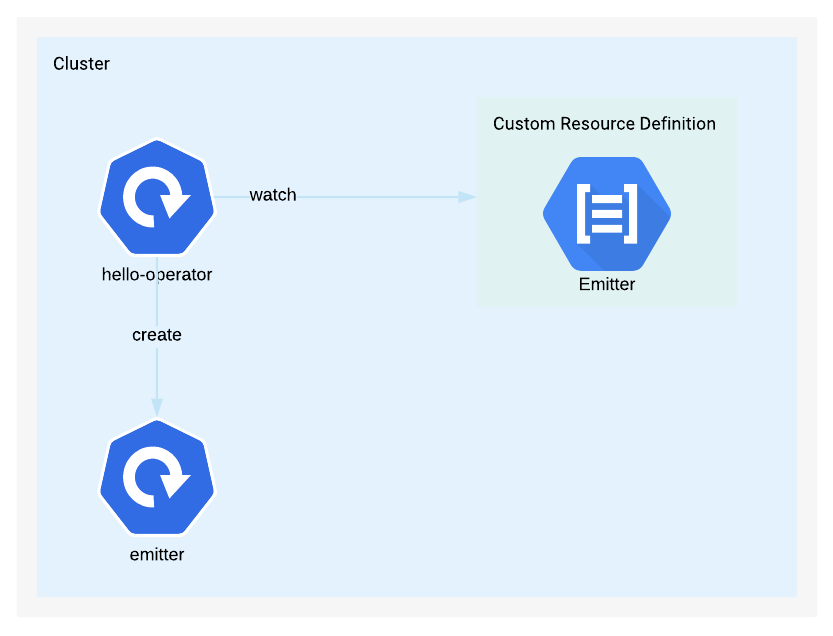

# hello-operator

This is a simple operator with a CRD built in Kubebuilder.

It has an Emitter type that when created will spawn a simple deployment that is created from the templates `./manifests/emitter-deployment.yaml`

To create this deployment run `kubectl apply -f ./config/samples` which will create the Emitter CRD and invoke the operators reconcile.

All the real logic is in `./controllers/emitter_controller.go`

## Up and running

- Have an existing connected Kubernetes cluster
- `make`
- `make install`
- `make run`
- `kubectl apply -f ./config/samples`
